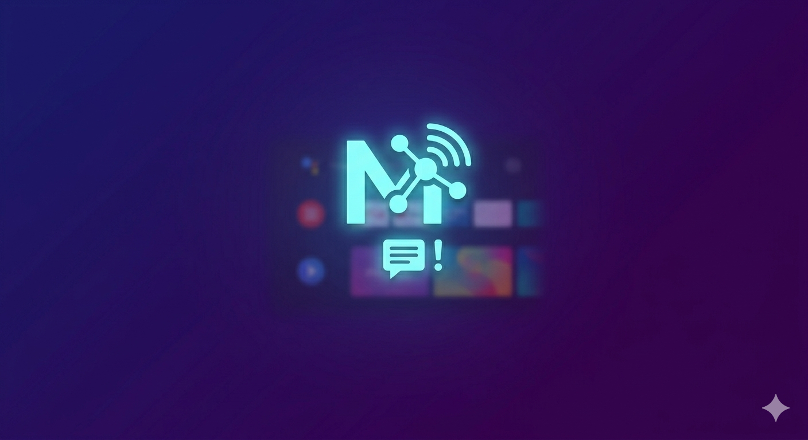

# Android TV MQTT Notification

An Android TV app that runs a persistent background service to subscribe to an MQTT topic and display **overlay notifications** directly on your TV screen — visible over any running app.



## Features

- 📡 **MQTT subscription** — connects to any broker using [Eclipse Paho](https://www.eclipse.org/paho/) (TCP)
- 🖥️ **Overlay notifications** — slides in from the top of the screen over any app, then auto-dismisses
- 🔄 **Auto-reconnect** — exponential back-off reconnection on connection loss
- 🚀 **Boot auto-start** — optionally starts the service on device boot
- 📋 **Message history** — in-app log of all received messages
- 🔒 **Authentication** — optional username/password MQTT auth
- ⚙️ **Configurable** — broker host, port, topic, overlay duration, and more
- 🔔 **Notification fallback** — falls back to Android system notifications if overlay permission is not granted

## How It Works

```
MQTT Broker  ──►  MqttForegroundService  ──►  OverlayManager
                        │                         │
                  MessageRepository          Slide-in banner
                        │                    (top of screen)
                  HistoryActivity
```

1. Configure your broker in the **Config** screen (launched from the TV home screen).
2. Start the service — it connects and subscribes to your topic.
3. When a message arrives, a banner slides in from the top of the screen for the configured duration.
4. Browse all received messages in the **History** screen.

## Message Payload Format

Messages can be plain text or JSON:

```json
{ "title": "Front Door", "description": "Motion detected" }
```

Plain-text payloads are shown as the title with no description.

## Configuration

| Setting | Default | Description |
|---|---|---|
| Broker Host | — | IP address or hostname of the MQTT broker |
| Broker Port | `1883` | TCP port |
| Topic | — | MQTT topic to subscribe to (e.g. `home/alerts/#`) |
| Username | — | Optional MQTT username |
| Password | — | Optional MQTT password |
| Auto-start on boot | `false` | Start service automatically after device reboot |
| Overlay duration | `5000 ms` | How long each notification banner stays on screen |

## Requirements

- Android **5.0+ (API 21)**, target SDK 35
- An Android TV device or emulator
- **Draw over other apps** permission (`SYSTEM_ALERT_WINDOW`) for overlay support
- A reachable MQTT broker (e.g. [Mosquitto](https://mosquitto.org/), Home Assistant, etc.)

## Permissions

| Permission | Purpose |
|---|---|
| `INTERNET` | Connect to MQTT broker |
| `ACCESS_NETWORK_STATE` | Monitor network connectivity |
| `FOREGROUND_SERVICE` | Keep MQTT service alive in the background |
| `SYSTEM_ALERT_WINDOW` | Draw overlay notifications over other apps |
| `RECEIVE_BOOT_COMPLETED` | Auto-start on device boot |

## Building

```bash
# Clone the repository
git clone https://github.com/pvalenta/AndroidTVMQTTNotification.git
cd AndroidTVMQTTNotification

# Build debug APK
./gradlew assembleDebug

# Install on connected device
./gradlew installDebug
```

Requires **Android Studio** or a JDK 17+ with Android SDK installed.

## Tech Stack

| Component | Library |
|---|---|
| Language | Kotlin |
| MQTT client | Eclipse Paho `mqttv3 1.2.5` |
| Settings persistence | Jetpack DataStore Preferences |
| Architecture | MVVM (ViewModel + Coroutines) |
| UI | Leanback (TV-optimised) + ViewBinding |
| Background service | Android Foreground Service |

## License

MIT License — see [LICENSE](LICENSE) for details.
